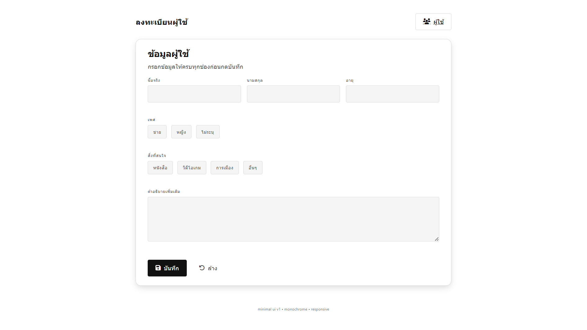
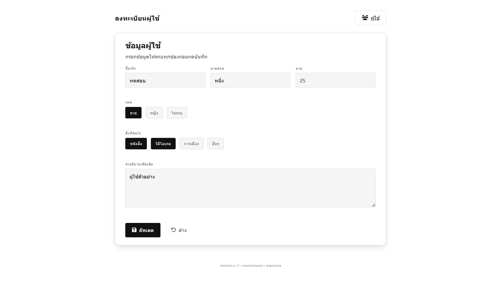
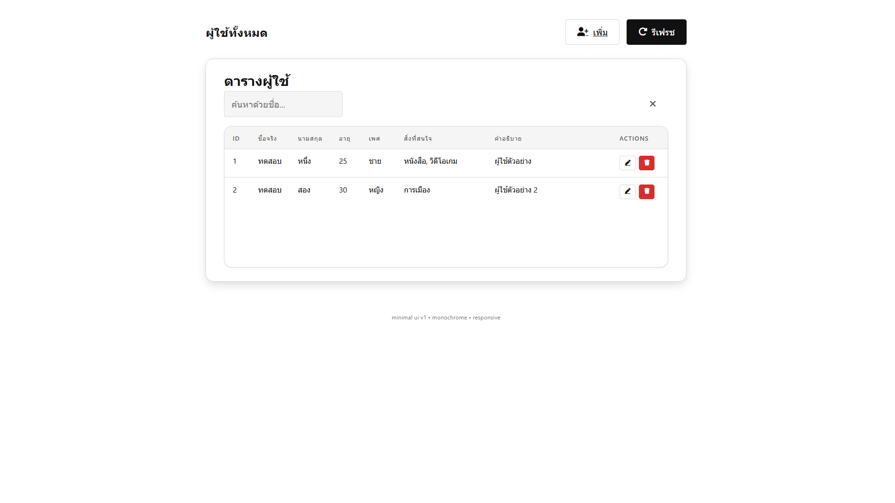
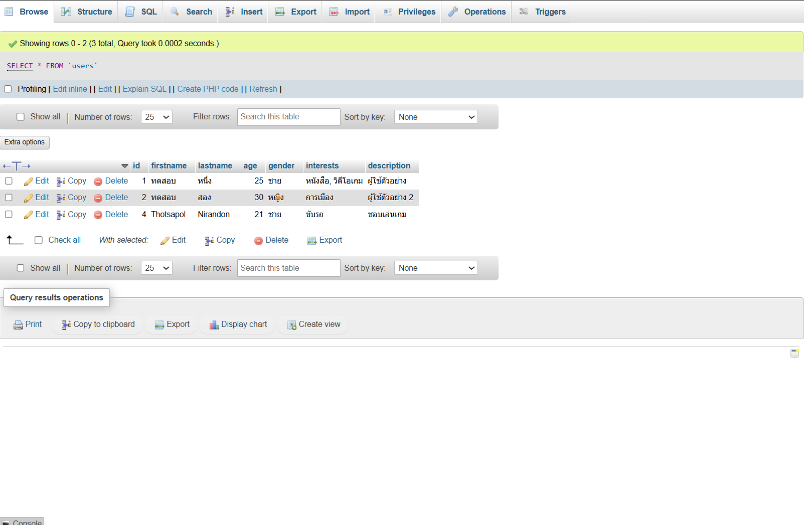

# โปรเจ็คส่วนตัว ปี 3 (2024)
# Minimal User Registry API & UI (Express + MySQL)



[](./server)
[](./server/index.js)
[](https://www.mysql.com/)
[](./server/docker-compose.yml)
[](./LICENSE)

เว็บแอปขนาดเล็กสำหรับ: ลงทะเบียน / จัดการผู้ใช้ (CRUD) พร้อมการตรวจสอบข้อมูล (Validation), Health Check, Metrics พื้นฐาน และสคริปต์ SQL ที่ปรับ Collation เป็น `utf8mb4` รองรับภาษาไทยครบถ้วน

---

## 📋 คุณสมบัติเด่น
- ลงทะเบียนผู้ใช้ (POST /users)
- แสดงรายการผู้ใช้ทั้งหมด (GET /users)
- ดูรายละเอียดรายคน (GET /users/:id)
- แก้ไขข้อมูล (PUT /users/:id)
- ลบข้อมูล (DELETE /users/:id)
- ค้นหา/กรองฝั่ง UI (JS ทำงานบนเบราว์เซอร์)
- Metrics พื้นฐาน (จำนวน users) (GET /metrics)
- Retry เชื่อมต่อฐานข้อมูลอัตโนมัติขณะแรกเริ่ม (เหมาะกับ Docker ที่ MySQL ยังบูตไม่เสร็จ)
- ฟรอนท์เอนด์ Static (Vanilla HTML/CSS/JS) ไม่ต้อง build

---

## 🏗️ สถาปัตยกรรมและโครงสร้างไฟล์

```
root/
├─ frontend/            # ไฟล์หน้าเว็บ (Form ลงทะเบียน + ตารางผู้ใช้)
│  ├─ index.html        # หน้าเพิ่มผู้ใช้
│  ├─ user.html         # หน้าแสดง/จัดการผู้ใช้
│  ├─ config.js         # ตรวจหา BASE_URL ของ API อัตโนมัติผ่าน /health
│  ├─ ui.js,user.js     # ฟังก์ชัน UI, เรียก API, เรนเดอร์ตาราง
│  └─ *.css             # สไตล์ (Minimal UI)
├─ server/
│  ├─ index.js          # Express API + MySQL pool + validation + graceful shutdown
│  ├─ package.json      # npm scripts (dev/start)
│  ├─ Dockerfile        # Image ของ API (Production minimal)
│  └─ docker-compose.yml# Stack: MySQL + phpMyAdmin + API
├─ users.sql            # สคริปต์สร้างฐานข้อมูล + ตาราง + seed ตัวอย่าง
└─ README.md            # ไฟล์นี้
```

---

## 🔌 Endpoints (REST)

| Method | Path          | Description                    | Body / Query |
|--------|---------------|--------------------------------|--------------|
| GET    | /             | Service meta / endpoints list  | - |
| GET    | /users        | ดึงผู้ใช้ทั้งหมด               | - |
| POST   | /users        | สร้างผู้ใช้ใหม่                | JSON payload |
| GET    | /users/:id    | ดึงผู้ใช้รายคน                 | - |
| PUT    | /users/:id    | แก้ไขข้อมูลผู้ใช้              | JSON payload (เฉพาะ field ที่ส่งมา) |
| DELETE | /users/:id    | ลบผู้ใช้                        | - |
| GET    | /health       | Health + db status             | - |
| GET    | /metrics      | Metrics (users_total)          | - |
| GET    | /debug/pingdb | ทดสอบเวลา NOW() จากฐานข้อมูล   | - |

```

เงื่อนไข Validation:
- firstname / lastname: บังคับ, ตัดความยาวสูงสุด 255
- age: ตัวเลข 0–120
- gender: หนึ่งใน `ชาย|หญิง|ไม่ระบุ`
- interests: อย่างน้อย 1, รวมข้อความไม่เกิน ~500 ตัวอักษร
- description: บังคับ, สูงสุด ~1000 ตัวอักษร

---

## 🚀 การติดตั้งและเริ่มต้นใช้งาน (โหมดพัฒนา Local)

### 1) ติดตั้งเครื่องมือพื้นฐาน
- Node.js 20+
- MySQL 8 (ถ้าไม่ใช้ Docker)

### 2) สร้างฐานข้อมูล (ถ้ามี MySQL ติดตั้งในเครื่อง)
```powershell
mysql -u root -p < users.sql
```

### 3) ตั้งค่า Environment Variables (ไฟล์ `.env` ภายในโฟลเดอร์ `server/`)
```env
PORT=8000
DB_HOST=127.0.0.1
DB_USER=root
DB_PASSWORD=root
DB_NAME=webdb
DB_PORT=3306
```

### 4) รัน Backend
```powershell
cd server
npm install
npm run dev
```
API จะเริ่มที่ `http://localhost:8000` (ถ้าพอร์ตชน จะขยับเป็น 8001, 8002 … ให้ดูข้อความใน console)

### 5) เปิด Frontend
เปิดไฟล์ `frontend/index.html` และ `frontend/user.html` ตรง ๆ (แนะนำใช้ VS Code Live Server หรือเปิดผ่าน `http://127.0.0.1` เพื่อหลีกเลี่ยง CORS ที่บางเบราว์เซอร์บล็อก `file://`)

`config.js` จะตรวจหาพอร์ต API ผ่าน `/health` อัตโนมัติ (ลอง 8000–8004)

---

## 🐳 การใช้งานผ่าน Docker Compose

ไฟล์: `server/docker-compose.yml`

บริการที่ได้:
- `db`          → MySQL 8 (expose 8820:3306)
- `phpmyadmin`  → phpMyAdmin (พอร์ต 8821)
- `api`         → Node.js Express (พอร์ต 8000)

### รันทั้งหมด
```powershell
cd server
docker compose up -d
phpMyAdmin: http://localhost:8821  (user: root / pass: root)
```
# ภาพตัวอย่างการใช้งาน




